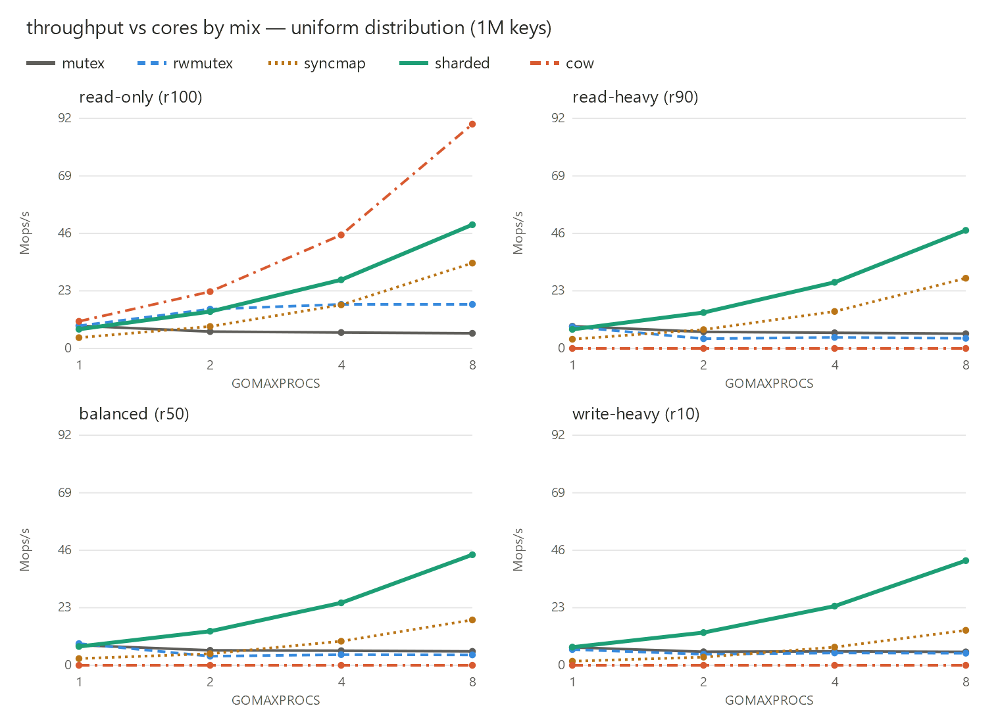
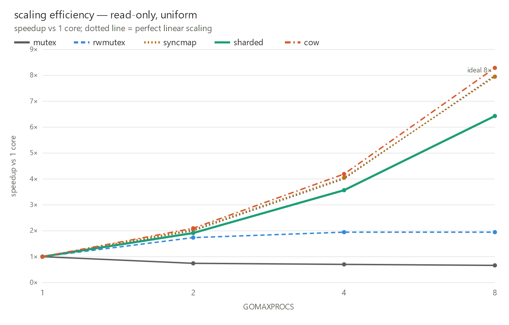
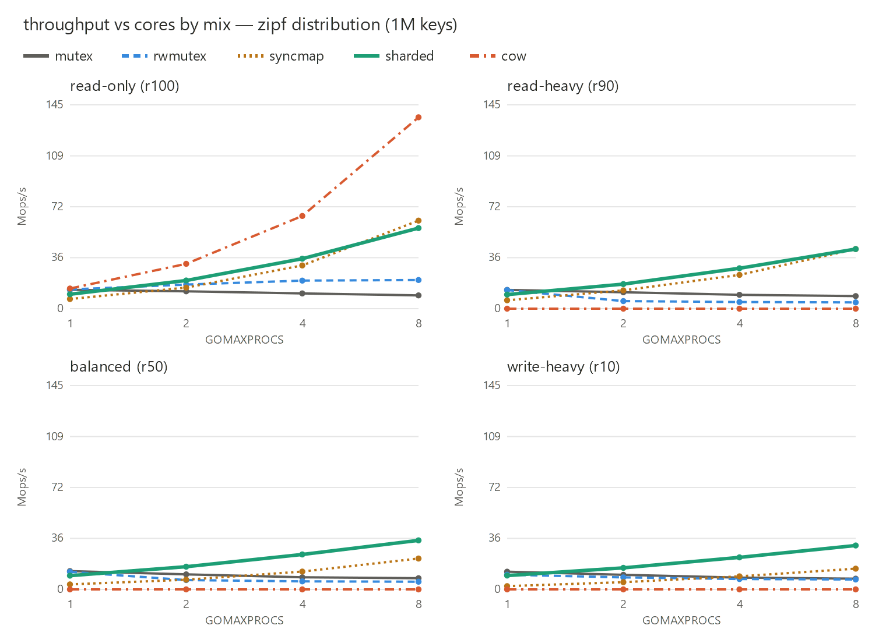
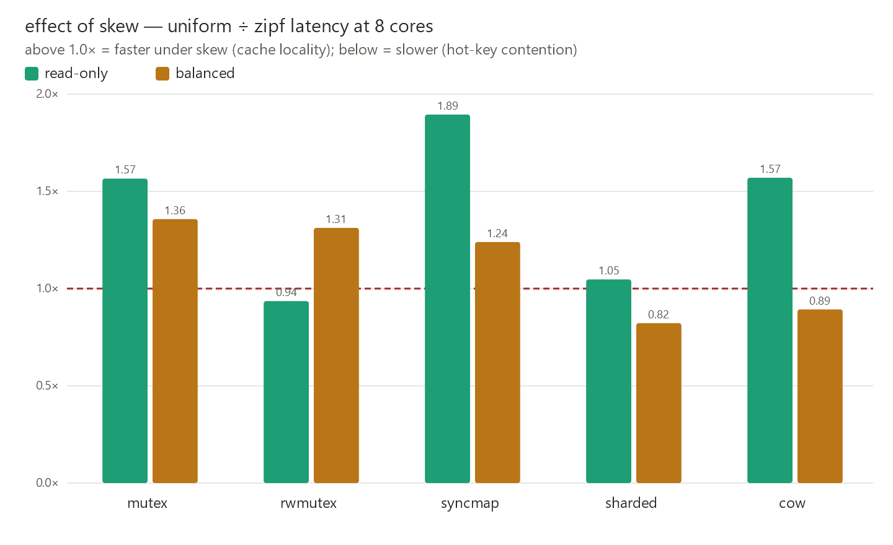

# in-memory-cache

Companion code for a blog post comparing in-memory cache implementations in
Go (standard library only) under different concurrent access patterns.

Every implementation is a `string -> string` map satisfying the same
[`Cache`](cache.go) interface, so a single benchmark harness can drive them
all under identical workloads. No eviction, no bounds — the focus is purely
the cost of *synchronization*.

## Implementations

| Name      | File                       | Idea | Notes |
|-----------|----------------------------|------|-------|
| `naive`   | [naive.go](naive.go)       | Plain map, no locking | Not thread-safe. Single-threaded baseline; concurrent writes crash the process. |
| `mutex`   | [mutex.go](mutex.go)       | One `sync.Mutex` for all ops | Reads cannot run in parallel. |
| `rwmutex` | [rwmutex.go](rwmutex.go)   | `sync.RWMutex` | Parallel reads; exclusive writes. |
| `syncmap` | [syncmap.go](syncmap.go)   | `sync.Map` | The stdlib's own answer; wins only for read-mostly / disjoint-key patterns. |
| `sharded` | [sharded.go](sharded.go)   | Lock striping (256 shards) | Canonical high-throughput design. Weak under skew. |
| `cow`     | [cow.go](cow.go)           | Copy-on-write via `atomic.Pointer` | Lock-free reads; O(n) writes. |

## Measurement design

Two tracks, deliberately separated:

- **Track A — in-process micro-benchmarks (the real measurement).**
  `testing.B` + `b.RunParallel`, calling `Get`/`Set` directly. This is where
  the synchronization strategies actually separate (nanosecond scale).
- **Track B — end-to-end HTTP (reality check).** [cmd/server](cmd/server)
  exposes a cache over JSON. Drive it with a load generator; expect the
  implementations to converge, because HTTP + JSON cost dwarfs the lock
  differences. Use a coordinated-omission-aware tool (`fortio`, `wrk2`) for
  honest tail latencies.

### Benchmark axes

- **Implementation** — the six above (`naive` only in the sequential bench).
- **Read/write mix** — `r100`, `r90`, `r50`, `r10` (read fraction).
- **Access distribution** — `uniform` and `zipf` (s=1.1 hot-key skew).
- **GOMAXPROCS** — via the `-cpu` flag; this is where contention scaling shows.
- **Key cardinality / length** — `-keys` and `-keylen` flags.

> **Why there is no value-size axis.** Values are shared, immutable Go strings,
> so `Set` stores a 16-byte header and never touches the value bytes. Varying
> the value size changes neither op throughput nor allocations — measured: 64 B
> and 16 KB are identical within noise, 0 B/op. Value size only affects total
> memory footprint and, through that, GC pause behavior; that is a separate
> experiment from the synchronization cost measured here, so the benchmarks fix
> the value at 64 B.

## Results

Headline run: 1,000,000 keys, `-count=10`, GOMAXPROCS swept 1→8, on a 20-core
i7-14700K. Full data in [results/](results/) (`summary.txt`, `by-impl.txt`);
regenerate the figures with `go run ./cmd/charts`.

### Throughput vs cores, by read/write mix (uniform)



`sharded` and `cow` scale up with cores; `mutex` is flat-to-declining (no read
parallelism, plus lock cache-line contention). `cow` owns read-only and
collapses to ≈0 throughput once writes appear (off-scale — see the table).

### Scaling efficiency (read-only, uniform)



Speedup vs each design's own 1-core baseline. `mutex` is *below* 1× (negative
scaling); `rwmutex` plateaus ~1.9× (the reader-counter wall); `sharded` hits
6.4×; `cow`/`syncmap` hug the ideal line — though `syncmap`'s near-linear slope
flatters a poor 1-core baseline (great scaling, still mediocre absolute).

### Effect of skew (Zipfian, s=1.1)





Skew is not uniformly "worse": reads get *faster* (hot keys stay in CPU cache),
but contended writes get *slower* for `sharded` and `cow` (hot keys concentrate
on a few shards / force more whole-map copies).

### Latency at 8 cores (ns/op, lower is better)

Uniform distribution:

| mix | mutex | rwmutex | syncmap | sharded | cow |
|---|--:|--:|--:|--:|--:|
| read-only (r100) | 166 | 57 | 29 | 20 | **11** |
| read-heavy (r90) | 169 | 247 | 36 | **21** | 11.3 ms |
| balanced (r50) | 179 | 241 | 55 | **23** | 40.3 ms |
| write-heavy (r10) | 187 | 207 | 71 | **24** | 80.6 ms |

Zipfian distribution (s=1.1):

| mix | mutex | rwmutex | syncmap | sharded | cow |
|---|--:|--:|--:|--:|--:|
| read-only (r100) | 106 | 61 | 15 | 19 | **7** |
| read-heavy (r90) | 116 | 208 | 23 | **22** | 8.9 ms |
| balanced (r50) | 132 | 183 | 44 | **28** | 45.2 ms |
| write-heavy (r10) | 137 | 143 | 66 | **30** | 83.0 ms |

`cow` write cells are in milliseconds because each `Set` copies the whole
million-entry map. Overall geomean vs the `mutex` baseline: `sharded` −60 %,
`syncmap` −19 %, `rwmutex` +6 %, `cow` off the chart (writes dominate).

## Running

```sh
# Correctness (fast):
go test -run Test ./...

# Confirm the concurrent implementations are race-free:
go test -race -run TestConcurrentSmoke

# See that the naive map is NOT thread-safe (expected to crash / fail):
INMEMCACHE_RACE_DEMO=1 go test -race -run TestNaiveRace

# Full Track A sweep across core counts (the headline numbers):
go test -bench=BenchmarkCache -benchmem -cpu=1,2,4,8 -keys=1000000

# Isolate one axis, e.g. zipf access across cores:
go test -bench='BenchmarkCache/impl=sharded/dist=zipf/' -cpu=1,2,4,8

# Uncontended per-op baseline (includes naive):
go test -bench=BenchmarkSequential -benchmem

# Track B HTTP server:
go run ./cmd/server -impl=sharded -addr=:8080
```

### Statistical summary with benchstat

The sweep is run with repetition (`-count`) and summarized with
[benchstat](https://pkg.go.dev/golang.org/x/perf/cmd/benchstat), which reports
means with variation and significance tests — the rigor a single `-bench` run
lacks. Two runners:

- [sweep.sh](sweep.sh) — **the publication runner** (used for the numbers above).
  Runs in three phases and merges them, measuring `cow`'s O(keys) write cells
  with a small fixed iteration count (they are ~10⁶× slower, so a few samples
  suffice) while everything else gets precise time-based measurement. Streams
  results live to `results/bench.txt`.
- [bench.ps1](bench.ps1) — a simpler single-pass PowerShell alternative for
  quick local runs.

```sh
# Publication sweep (bash):
KEYS=1000000 COUNT=10 CPU=1,2,4,8 bash sweep.sh
```
```powershell
# Quick single-pass check (PowerShell):
.\bench.ps1 -Keys 5000 -Count 6 -Cpu 4 -Benchtime 100ms
```

Both write three files to `results/`:

- `bench.txt`   — raw `go test -bench` output (UTF-8, re-readable by benchstat).
- `summary.txt` — per-benchmark mean ± coefficient of variation.
- `by-impl.txt` — implementations pivoted into columns (`benchstat -col /impl`),
  with % delta and p-values vs. the baseline implementation.

The `impl=…/dist=…/mix=…` sub-benchmark naming is what lets benchstat pivot any
axis; e.g. `benchstat -col /mix results/bench.txt` compares mixes instead. Aim
for variation under ~5%; if it's higher, raise `-benchtime` and `-Count`, and
close background apps.

> One-off install of benchstat:
> `go install golang.org/x/perf/cmd/benchstat@latest`

> Memory note: because all keys share one value buffer, memory is modest —
> roughly `keys * (key length + ~48 B map overhead)`, e.g. a few hundred MB at
> `-keys=1000000`. (The `cow` write path transiently allocates a second copy
> of the map's headers.)

### Reproducibility / methodology notes

- Each benchmark goroutine uses its own `*rand.Rand` (seeded from a counter),
  so there is no shared-RNG lock contention polluting the numbers, and runs
  are deterministic.
- Per-op RNG cost is constant across implementations, so it does not affect
  their *relative* ranking.
- Never benchmark with `-race` on; it changes timings by 5–20×. Use it only
  for the correctness passes above.
- `cow` writes are O(n); write-heavy `cow` benchmarks are intentionally slow
  and will report few iterations. That is the honest result, not a bug.
