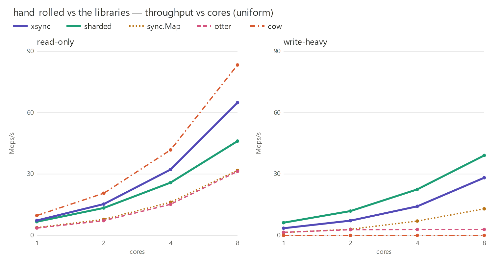

[Last time](../shard-your-locks/) I built the same in-memory cache six ways with
nothing but Go's standard library, and a 256-way sharded map won: it scaled
near-linearly and beat a single `sync.Mutex` by up to 8×. The conclusion was
"shard your locks." The most common reply — including a
[pull request](https://github.com/kluyg/in-memory-cache/pull/1) from Michael
Gebetsroither — was fair: **stdlib-only is a nice constraint, but in the real
world you'd reach for a library. How does hand-rolled actually compare?**

So I dropped the constraint and added the two everyone names:
[`xsync`](https://github.com/puzpuzpuz/xsync) (a CLHT-based concurrent map) and
[`otter`](https://github.com/maypok86/otter) (a W-TinyLFU cache), and re-ran the
whole pinned benchmark with all of them.

**TL;DR:** For **reads**, `xsync` beats my hand-rolled `sharded` map — its
lock-free reads are the real deal. For **writes**, `sharded` still wins, and
it's zero-allocation. And `otter` is a trap if you benchmark it as a map: it's
*slower than a plain mutex* on writes, because it's not a map — it's an eviction
cache, and eviction isn't free.

## The new contenders

| Cache | What it is | Notes |
|---|---|---|
| `sharded` | 256 mutex-guarded shards (the hand-rolled champion) | stdlib only, zero deps, zero alloc. |
| `xsync` | `puzpuzpuz/xsync/v4` `MapOf` | CLHT — lock-free reads, cooperative rehashing. |
| `otter` | `maypok86/otter/v2` | W-TinyLFU eviction cache (sized so nothing evicts here). |
| `sync.Map` | stdlib | The standard library's own concurrent map, for reference. |
| `cow` | copy-on-write (stdlib) | Lock-free reads, but O(n) writes — the read ceiling. |

Same machine and harness as before: pinned to the 8 physical P-cores of an
i7-14700K, 1,000,000 keys, `b.RunParallel`, n=10 with `benchstat`. The only
change is two extra implementations. (`otter` is configured with a huge max size
so nothing is evicted during the run — we're measuring its hot path, not its
eviction policy.)

## The results

The chart above is throughput (higher is better); the tables below are latency
in nanoseconds per op (lower is better), uniform keys at 8 cores — all in ns, so
COW's write cost shows for what it is:

**Read-only:**

| cow | **xsync** | sharded | sync.Map | otter |
|--:|--:|--:|--:|--:|
| 12 | **15** | 22 | 31 | 32 |

**Write-heavy:**

| **sharded** | xsync | sync.Map | otter | cow |
|--:|--:|--:|--:|--:|
| **26** | 36 | 77 | 345 | 94,000,000 |

## Three findings

**1. For reads, the library wins.** `xsync` does 15 ns reads at 8 cores; my
hand-rolled `sharded` does 22 ns — `xsync` is ~30% faster, and only the
write-useless copy-on-write map beats it. Its CLHT design gives genuinely
lock-free reads, and it shows. Under skewed (Zipfian) access the gap *widens* —
`xsync` reads at 9.9 ns vs `sharded`'s 18 ns, nearly 2×, because hot keys hammer
a few of `sharded`'s shards while `xsync` has no per-key lock to contend on.

**2. For writes, hand-rolled still wins — and allocates nothing.** `sharded`
does 26 ns writes at 8 cores; `xsync` 36 ns. And `sharded` is **zero-allocation**
on the write path, while the libraries aren't: `xsync` 28 B/op, `otter` 58 B/op,
`sync.Map` a hefty 71 B/op and 2 allocs (interface boxing). Sixteen lines of
stdlib still beats every library on the write-heavy mix.

**3. `otter` is not a map, and the benchmark proves it.** It's *slower than a
single mutex* on writes (345 ns vs 227 ns) and its write throughput is flat —
adding cores barely helps. That's not a flaw; it's the cost of being a real
cache. Every operation touches admission and frequency-sketch bookkeeping so it
can decide what to *evict* — work a bare map never does. Benchmark `otter` as a
fast map and it looks terrible. Reach for it when you actually need bounded
memory, TTLs, and a good hit rate under churn — which is most production caches.

## What to actually use

- **Read-dominated, no eviction needed → `xsync`.** It's faster than anything
  you'll hand-roll for reads, battle-tested, and a one-line dependency. This is
  the case where the library clearly earns its place.
- **Write-heavy, or you want zero dependencies / zero allocations → `sharded`.**
  The 16-line stdlib map is still the best writer and adds nothing to your
  `go.mod`.
- **You need eviction, TTL, or a memory bound → `otter` (or similar).** Don't
  compare it to a map on raw throughput; compare it to *not having eviction* and
  OOM-ing. Different job.
- **`sync.Map`:** still only its niche (write-once / disjoint keys), and it
  allocates the most. The other options dominate it here.

## So was "shard your locks" wrong?

No — but "always hand-roll it" would have been. Sharding is still the best thing
you can build from the standard library, it still wins write-heavy workloads,
and it's still zero-alloc and zero-dependency. But the honest, measured answer to
"do you even need a library?" is: **for read-dominated workloads, yes — `xsync`
is simply faster than what you'll write by hand.** The right tool depends on your
read/write mix, your appetite for a dependency, and whether you need eviction at
all.

Thanks to [Michael Gebetsroither](https://github.com/kluyg/in-memory-cache/pull/1)
for the PR that prompted this round, and to everyone in the comments who asked
the obvious question. The code, the new implementations, and the one-command
pinned sweep are all in the [repo](https://github.com/kluyg/in-memory-cache).
